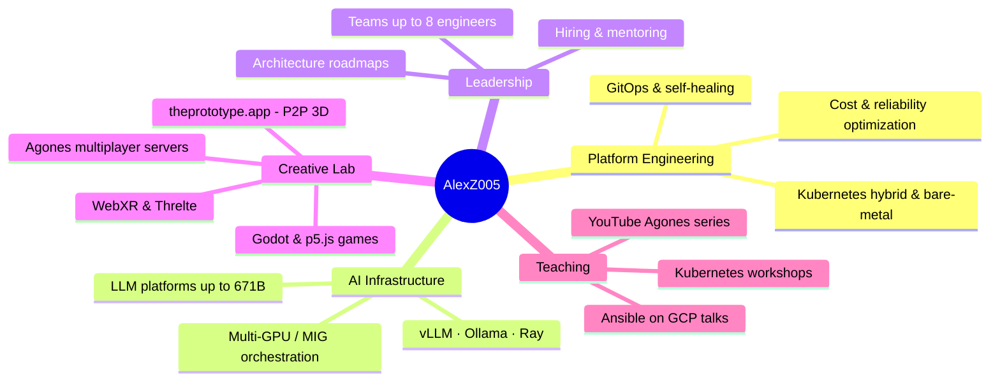

## ⚡ whoami

Platform Engineer / Infrastructure Architect and Team Lead with **15+ years** of experience delivering scalable cloud and self-hosted platforms. I build internal platforms, AI infrastructure, and high-performance systems - and I lead the teams that run them (up to 8 engineers: hiring, mentoring, architecture ownership).

- 🧠 **AI infra at scale** - GPU orchestration on Kubernetes (MIG profiles, multi-GPU scheduling, H100-class nodes), LLM stacks with **vLLM · Ollama · Ray/KubeRay**, models up to **671B parameters** in multi-GPU environments
- ☸️ **Kubernetes everywhere** - EKS, kubeadm, Kubespray, hybrid cloud + bare-metal, custom **Calico CNI** traffic routing, GitOps with automated self-healing
- 🛠️ **Platform services** in Go & Python, Terraform, GitHub Actions with self-hosted runners, Karpenter autoscaling, APISIX
- 🎮 **Off-hours**: real-time 3D on the web (Svelte + Threlte + WebXR), multiplayer game servers on **Agones**, Godot games, and electronics - my GitHub history starts with quadcopters and Arduino PID loops

## 🚀 Now building - [theprototype.app](https://theprototype.app)

> **Collaborative peer-to-peer 3D prototyping in the browser. Open source, no backend.**
> Svelte 5 + Threlte, P2P sync, zip-installable community modules, content packs, and a PR-driven community gallery.

| Repo | What it is |
|---|---|
| [`core`](https://github.com/theprototype-app/core) | The engine - collaborative P2P 3D prototyping, no server required |
| [`modules`](https://github.com/theprototype-app/modules) | Optional & community modules, zip-installable |
| [`docs`](https://github.com/theprototype-app/docs) | User & SDK documentation (MkDocs Material) |
| [`community-gallery`](https://github.com/theprototype-app/community-gallery) | Submit scenes via PR, browse in-app |

## 🧰 Arsenal

| Domain | Daily drivers |
|---|---|
| **Orchestration** | Kubernetes (EKS · kubeadm · Kubespray), Karpenter, Agones, MetalLB, Helm |
| **AI / GPU** | vLLM, Ollama, Ray / KubeRay, NVIDIA MIG, ComfyUI, n8n, DataBricks pipelines |
| **IaC & CI/CD** | Terraform, GitHub Actions (self-hosted runners), GitOps, Ansible |
| **Languages** | Go, Python, JavaScript/TypeScript, Bash |
| **Networking** | Calico CNI customization, APISIX, WebRTC / PeerJS |
| **3D & Web** | Svelte 5, Threlte / Three.js, WebSockets, WebXR, Godot |

<b>🗺️ Interactive map of what I do (click to expand)</b>

## 🎨 Creative lab

| Project | Stack | Notes |
|---|---|---|
| vrvsvr | Go · Node · WebSockets · Agones | Scalable 3D/VR web platform with session-based multiplayer workloads |
| [threlte-flow](https://github.com/AlexZ005/threlte-flow) | Svelte · Threlte | Node-based 3D flow experiments ⭐ |
| [agones-multiplayer-demo](https://github.com/AlexZ005/agones-multiplayer-demo) | K8s · Agones | Companion code for my YouTube tutorial series |
| [skycoiner](https://github.com/AlexZ005/skycoiner) | PeerJS | Serverless P2P multiplayer game |
| [beaver-jewels](https://alexz005.github.io/beaver-jewels/) | Godot / GDScript | Match-3 with beavers 🦫 |
| [master-morse-web](https://github.com/AlexZ005/master-morse-web) | HTML/JS | Interactive Morse-code trainer |
| [QuadSim](https://github.com/AlexZ005/QuadSim) | C# | Quadcopter simulator - where it all began (2015) |

## 📊 Stats

<picture>
  <source media="(prefers-color-scheme: dark)" srcset="https://github-readme-stats.vercel.app/api?username=AlexZ005&show_icons=true&theme=tokyonight&hide_border=true&bg_color=00000000&rank_icon=github"/>
  
</picture>
<picture>
  <source media="(prefers-color-scheme: dark)" srcset="https://github-readme-stats.vercel.app/api/top-langs/?username=AlexZ005&layout=compact&theme=tokyonight&hide_border=true&bg_color=00000000&langs_count=8"/>
  
</picture>

<picture>
  <source media="(prefers-color-scheme: dark)" srcset="https://github-readme-activity-graph.vercel.app/graph?username=AlexZ005&theme=tokyo-night&hide_border=true&bg_color=00000000&area=true"/>
  
</picture>

## 🎤 Talks & teaching

📺 YouTube tutorial series on **Agones** (game server hosting on Kubernetes) · 🛠️ Kubernetes workshops (cluster building, services, volumes) · ☁️ Conference talks: *Ansible on GCP - boosting your playbooks* · 🏔️ **Arctic Code Vault Contributor**

## ☕ Fun facts

`while(alive) {`  orchestrate GPUs by day 🖥️ · build 3D worlds by night 🌐 · play saxophone 🎷 · learn languages Spanish/Chinese - 你曾在这里 🀄 · 📷🐛 · gym/euc/hiking  `}`

💬 Open to interesting conversations about platform engineering, AI infrastructure, and multiplayer 3D on the web.

